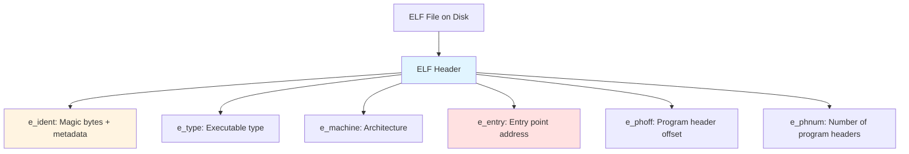
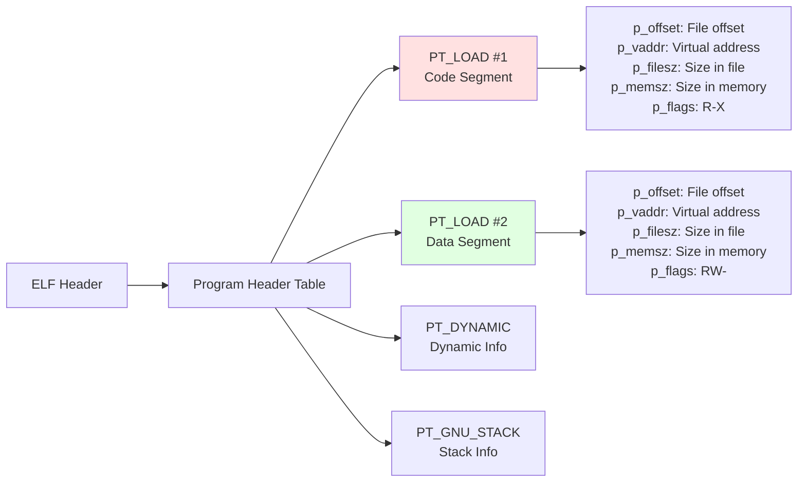
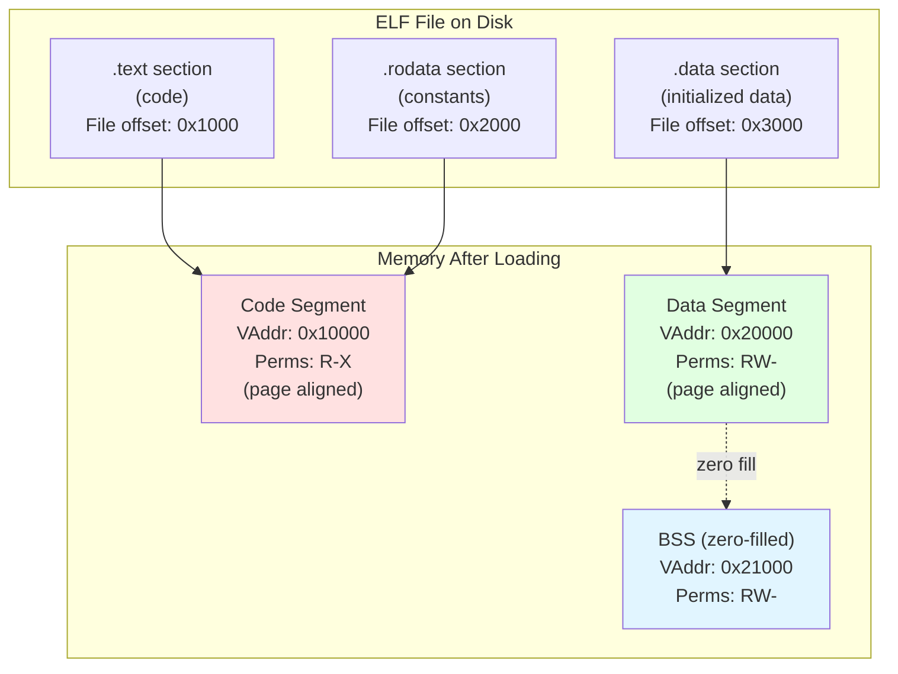
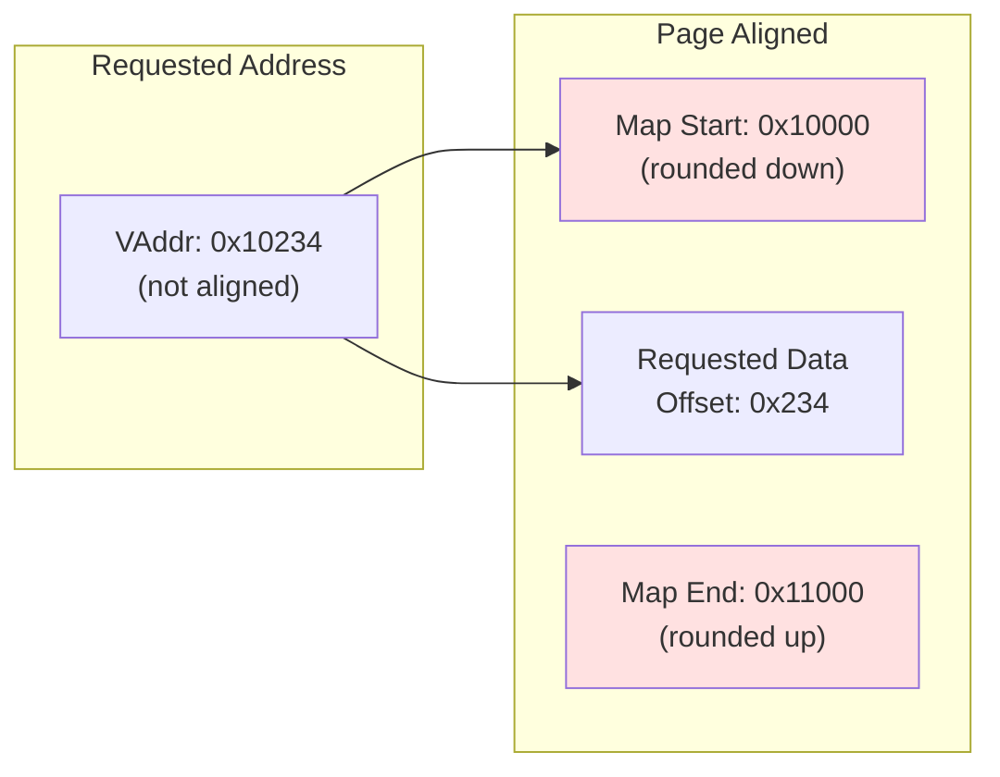
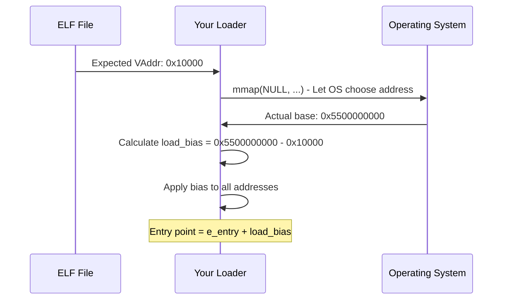
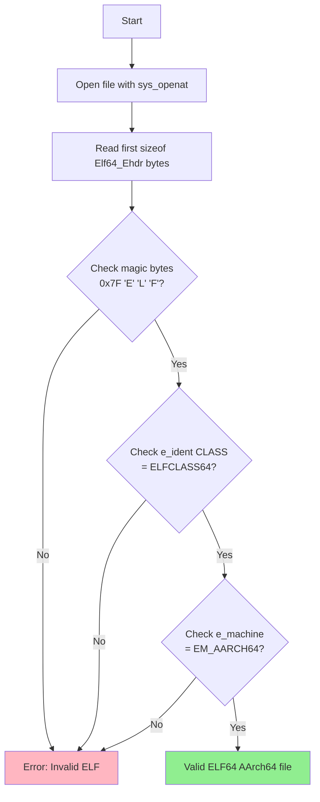
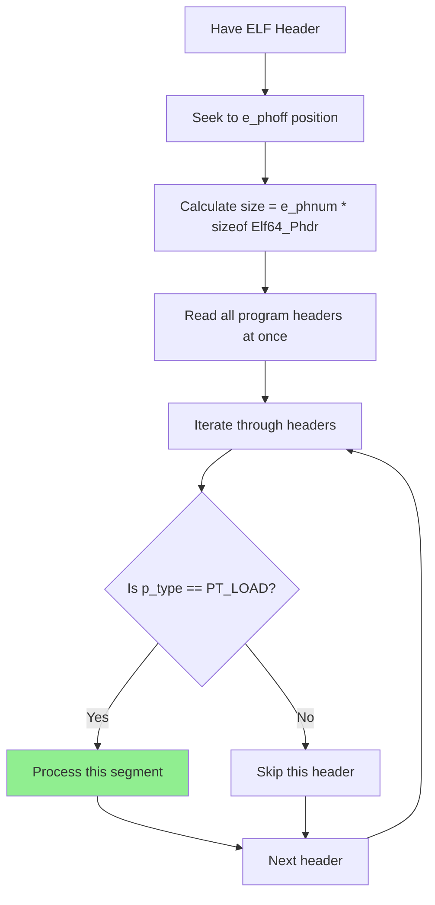
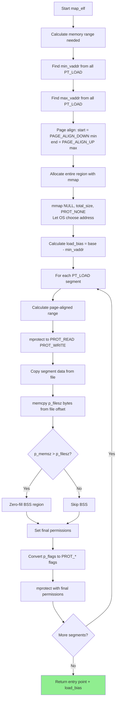

# ELF Loading Assignment - Detailed Guide

## Table of Contents

1. [Overview](#overview)
2. [Understanding ELF File Structure](#understanding-elf-file-structure)
3. [Memory Mapping Concepts](#memory-mapping-concepts)
4. [Step-by-Step Implementation Guide](#step-by-step-implementation-guide)
5. [Assignment Problems](#assignment-problems)
6. [Testing Your Code](#testing-your-code)
7. [Resources](#resources)

---

## Overview

In this assignment, you will explore the **ELF (Executable and Linkable Format)** file format by implementing several programs that analyze and load ELF binaries. All programs must be built as **static-PIE executables with no libc dependency**, giving you hands-on experience with low-level systems programming on AArch64.

### Learning Objectives

By completing this assignment, you will:

- Understand the structure of ELF files (headers, program headers, segments)
- Learn how the operating system loads executables into memory
- Work with system calls directly without libc
- Implement memory management using `mmap` and `mprotect`
- Handle virtual memory, page alignment, and memory permissions
- Build a minimal ELF loader that can execute other programs

---

## Understanding ELF File Structure

An ELF file contains three main components that you'll work with:

### 1. ELF Header (Elf64_Ehdr)

The ELF header is the first structure in the file and describes the overall file format:



**Key Fields:**

- `e_ident[16]`: Magic bytes (0x7F 'E' 'L' 'F'), class (32/64-bit), endianness
- `e_type`: ET_EXEC (executable), ET_DYN (PIE/shared object)
- `e_machine`: EM_AARCH64 (183) for ARM64
- `e_entry`: Virtual address where execution begins
- `e_phoff`: File offset to program headers
- `e_phnum`: Number of program headers

### 2. Program Headers (Elf64_Phdr)

Program headers describe **segments** - contiguous regions of memory to be loaded:



**Key Fields for PT_LOAD:**

- `p_type`: PT_LOAD means this segment should be loaded into memory
- `p_offset`: Where in the file the segment data starts
- `p_vaddr`: Virtual address where segment should be mapped
- `p_filesz`: How many bytes to read from file
- `p_memsz`: How many bytes the segment occupies in memory (usually >= p_filesz)
- `p_flags`: Permissions - PF_R (read), PF_W (write), PF_X (execute)

**Important:** When `p_memsz > p_filesz`, the extra bytes form the BSS section (uninitialized data) and must be zero-filled.

### 3. Segments in Memory

This diagram shows how file segments are mapped into memory:



---

## Memory Mapping Concepts

### Page Alignment

Memory must be mapped at **page boundaries** (4096 bytes = 0x1000 on most systems).



**Alignment Macros:**

```c
#define PAGE_SIZE 0x1000
#define PAGE_ALIGN_DOWN(x) ((x) & ~(PAGE_SIZE - 1))
#define PAGE_ALIGN_UP(x) (((x) + PAGE_SIZE - 1) & ~(PAGE_SIZE - 1))
```

### Position Independent Executables (PIE)

PIE executables can be loaded at any address. The loader must calculate a **load bias**:



**Load Bias Calculation:**

```c
// Find minimum virtual address from all PT_LOAD segments
uint64_t min_vaddr = 0x10000;  // example

// Let OS choose where to map
void *base = sys_mmap(NULL, total_size, ...);  // Returns actual address

// Calculate bias
uintptr_t load_bias = (uintptr_t)base - min_vaddr;

// Apply to all addresses
uintptr_t actual_entry = ehdr->e_entry + load_bias;
```

---

## Step-by-Step Implementation Guide

### Step 1: Reading the ELF Header



**Implementation Template:**

```c
Elf64_Ehdr ehdr;
int fd = sys_openat(AT_FDCWD, filename, O_RDONLY);
sys_read(fd, &ehdr, sizeof(ehdr));

// Validate
if (ehdr.e_ident[EI_MAG0] != 0x7F ||
    ehdr.e_ident[EI_MAG1] != 'E' ||
    ehdr.e_ident[EI_MAG2] != 'L' ||
    ehdr.e_ident[EI_MAG3] != 'F') {
    // Invalid ELF
}
```

### Step 2: Reading Program Headers

Program headers start at file offset `e_phoff`:



**Implementation Template:**

```c
// Seek to program headers
sys_lseek(fd, ehdr.e_phoff, SEEK_SET);

// Allocate and read program headers
size_t phdr_size = ehdr.e_phnum * sizeof(Elf64_Phdr);
Elf64_Phdr *phdr_table = /* allocate memory */;
sys_read(fd, phdr_table, phdr_size);

// Iterate
for (int i = 0; i < ehdr.e_phnum; i++) {
    if (phdr_table[i].p_type == PT_LOAD) {
        // Process loadable segment
    }
}
```

### Step 3: Memory Mapping Process

This is the most complex part. Here's the complete flow:



### Step 4: Setting Memory Permissions

Convert ELF flags to mmap protection flags:

```c
int prot = 0;
if (phdr->p_flags & PF_R) prot |= PROT_READ;
if (phdr->p_flags & PF_W) prot |= PROT_WRITE;
if (phdr->p_flags & PF_X) prot |= PROT_EXEC;

sys_mprotect(segment_addr, segment_size, prot);
```

**Common Segment Permissions:**

- Code segment (`.text`): `R-X` (PROT_READ | PROT_EXEC)
- Read-only data (`.rodata`): `R--` (PROT_READ)
- Data segment (`.data`, `.bss`): `RW-` (PROT_READ | PROT_WRITE)

### Step 5: Jumping to Entry Point


**Implementation:**

```c
uintptr_t entry = map_elf(elf_data, size);  // Returns entry with load_bias applied

// Cast to function pointer and call
void (*entry_func)(void) = (void (*)(void))entry;
entry_func();

// Should never return
```

---

## Assignment Problems

### Problem 1: Debug ELF Header (10 points)

**File:** `src/debug_elf_header.c`

Implement a program that reads an ELF file and displays its header information.

**Usage:**

```bash
./bin/debug_elf_header <elf_file>
```

**Requirements:**

- Open and read the ELF file using `sys_openat` and `sys_read`
- Validate the ELF magic bytes (0x7F, 'E', 'L', 'F')
- Parse and display:
  - Magic bytes
  - Class (ELF32/ELF64)
  - Endianness
  - OS/ABI
  - Type (EXEC, DYN, etc.)
  - Machine architecture (should be AArch64)
  - Entry point address
  - Program and section header information

---

### Problem 2: Validate ELF (10 points)

**File:** `src/validate_elf.c`

Implement a program that validates an ELF at a given virtual address (useful for debugging loaded programs).

**Usage:**

```bash
./bin/validate_elf <virtual_address>
```

**Requirements:**

- Parse the virtual address from command line (hex format: 0x400000)
- Cast the address to an `Elf64_Ehdr *` pointer
- Validate:
  - ELF magic bytes
  - ELF64 class
  - Little-endian encoding
  - AArch64 architecture

---

### Problem 3: Debug Program Headers (10 points)

**File:** `src/debug_program_headers.c`

Display all program headers from an ELF file in a formatted table.

**Usage:**

```bash
./bin/debug_program_headers <elf_file>
```

**Requirements:**

- Read ELF header to find program headers location (`e_phoff`)
- Iterate through all program headers (`e_phnum` entries)
- For each program header, display:
  - Type (LOAD, DYNAMIC, INTERP, etc.)
  - File offset
  - Virtual address
  - Physical address
  - File size
  - Memory size
  - Flags (R/W/X)
  - Alignment

---

### Problem 4: Debug Segments (10 points)

**File:** `src/debug_segments.c`

Analyze PT_LOAD segments and display how they will be mapped into memory.

**Usage:**

```bash
./bin/debug_segments <elf_file>
```

**Requirements:**

- Filter program headers for PT_LOAD segments only
- For each PT_LOAD segment, display:
  - Requested virtual address range
  - Page-aligned address range
  - Size in bytes and pages
  - File offset and size
  - BSS/zero-filled regions (if memsz > filesz)
  - Permissions (PROT_READ, PROT_WRITE, PROT_EXEC)

---

### Problem 5: Mini Loader (35 points)

**File:** `src/mini_loader.c`

Implement a minimal ELF loader that can load and execute static-PIE binaries.

**Usage:**

```bash
./bin/mini_loader <elf_file>
```

#### Function 1: `read_file_into_memory()` (10 points)

Read an entire file into memory.

**Requirements:**

- Open file with `sys_openat(AT_FDCWD, path, O_RDONLY)`
- Get file size with `sys_lseek(fd, 0, SEEK_END)`
- Allocate memory with `sys_mmap`
- Read file contents with `sys_read`
- Return pointer to file data (or NULL on error)

#### Function 2: `map_elf()` (20 points)

Map ELF segments into memory with correct permissions.

**Requirements:**

1. **Validate ELF:**
   - Check magic bytes
   - Verify ELF64, little-endian, AArch64

2. **Calculate memory range:**
   - Find minimum and maximum virtual addresses from all PT_LOAD segments
   - Calculate page-aligned total size needed

3. **Allocate memory region:**
   - Use `sys_mmap` with `PROT_NONE` initially
   - Let OS choose base address (important for PIE!)
   - Calculate load bias: `(actual_base - min_vaddr)`

4. **Load each PT_LOAD segment:**
   - Set permissions to RW temporarily
   - Copy file data to memory using `memcpy()`
   - Zero-fill BSS if `p_memsz > p_filesz`
   - Apply correct final permissions (R/W/X) with `sys_mprotect()`

5. **Return entry point:**
   - Return `ehdr->e_entry + load_bias`

#### Function 3: `load_elf_from_path()` (5 points)

**Requirements:**

- Call `read_file_into_memory()`
- Call `map_elf()`
- Cast entry point to function pointer: `void (*entry_func)(void) = (void (*)(void))entry`
- Jump to entry point: `entry_func()`

---

## Testing Your Code

### Build All Programs

```bash
make
```

### Test Individual Programs

```bash
# Test on the sample binary
./bin/debug_elf_header bin/sample
./bin/debug_program_headers bin/sample
./bin/debug_segments bin/sample
```

### Test Your Loader

```bash
# Run the provided sample program directly
./bin/sample

# Run it through your loader
./bin/mini_loader bin/sample
```

### Use the Test Suite

We provide a simple hello world test:

```bash
make test
```

This runs your loader on a minimal hello world program that uses direct syscalls.

**Expected output:**

```
Running test: mini_loader loading hello_world...
==============================================
Loading ELF: bin/hello_world
File loaded: 6040 bytes
Entry point: 0x...
Jumping to entry point...

Hello, World!
==============================================
Test completed successfully!
```

### Compare with readelf

Use `readelf` to verify your output:

```bash
# View ELF header
readelf -h bin/sample

# View program headers
readelf -l bin/sample

# View all headers
readelf -a bin/sample
```

---

## Common Issues and Debugging Tips

### Issue 1: Segmentation Fault in Loader

**Possible causes:**

- Page alignment not calculated correctly
- Load bias not applied to all addresses
- Memory permissions not set (try to execute non-executable memory)
- Copying data to wrong address

**Debug strategy:**

```c
// Add debug prints
mini_printf("Mapping segment at %p, size %d\n", segment_addr, segment_size);
mini_printf("Load bias: %p\n", (void*)load_bias);
mini_printf("Entry point: %p\n", (void*)entry);
```

### Issue 2: mmap Fails

**Possible causes:**

- Size not page-aligned
- Invalid protection flags
- Using MAP_FIXED without proper address

**Solution:**

```c
// Don't use MAP_FIXED - let OS choose
void *base = sys_mmap(NULL, total_size, PROT_NONE,
                      MAP_PRIVATE | MAP_ANONYMOUS, -1, 0);
```

### Issue 3: Program Doesn't Execute

**Possible causes:**

- Entry point calculation wrong
- Code segment missing PROT_EXEC
- Not applying load bias to entry point

**Verification:**

```c
// Verify permissions are set
mini_printf("Setting perms for segment: ");
if (prot & PROT_READ) mini_printf("R");
if (prot & PROT_WRITE) mini_printf("W");
if (prot & PROT_EXEC) mini_printf("X");
mini_printf("\n");
```

### Issue 4: Data Corruption

**Possible causes:**

- Not zero-filling BSS section
- Copying wrong amount of data
- Off-by-one errors in size calculations

**Verification:**

```c
// Check BSS handling
if (phdr->p_memsz > phdr->p_filesz) {
    size_t bss_size = phdr->p_memsz - phdr->p_filesz;
    mini_printf("BSS section: %d bytes to zero-fill\n", (int)bss_size);
}
```

---

## Provided Infrastructure

### Headers (`inc/`)

- `syscalls.h` - Complete syscall infrastructure with wrappers for aarch64
- `elf_format.h` - ELF structures from `<elf.h>` and `<stdint.h>`
- `utils.h` - Utility functions (memcpy, memset, strcpy, strlen, mini_printf)
- `elf_debug.h` - Placeholder header for your programs
- `mini_loader.h` - Function declarations for the loader

### Source Files (`src/`)

- `start.S` - Custom `_start` entry point that sets up argc/argv/envp
- `utils.c` - Full implementations of all utility functions
- `sample.c` - Test program for verifying your implementations
- `hello_world.c` - Minimal test program using only syscalls

### Available System Calls

All syscalls are provided in `syscalls.h`:

- `sys_read(fd, buf, count)` - Read from file descriptor
- `sys_write(fd, buf, count)` - Write to file descriptor
- `sys_openat(AT_FDCWD, path, O_RDONLY)` - Open file
- `sys_close(fd)` - Close file descriptor
- `sys_lseek(fd, offset, whence)` - Seek in file
- `sys_mmap(addr, len, prot, flags, fd, offset)` - Map memory
- `sys_munmap(addr, len)` - Unmap memory
- `sys_mprotect(addr, len, prot)` - Change memory protection
- `sys_exit(status)` - Exit program

---

## Submission

### Create Submission Package

```bash
make submission.zip
```

### Upload to Gradescope

Upload `submission.zip` containing:

- `src/` directory with all your source files
- `inc/` directory with headers
- `Makefile`

---

## Resources

### Official Documentation

- [ELF Format Specification](https://refspecs.linuxfoundation.org/elf/elf.pdf) - The official ELF specification
- [ARM64 ABI Documentation](https://github.com/ARM-software/abi-aa) - AArch64 calling conventions
- [Linux System Call Reference](https://man7.org/linux/man-pages/man2/syscalls.2.html) - System call documentation

### Man Pages

Use these commands on Linux systems:

```bash
man elf          # ELF structure reference
man 2 mmap       # mmap syscall
man 2 mprotect   # mprotect syscall
man 2 read       # read syscall
```

### Tools

- `readelf` - Display ELF file information
- `objdump` - Disassemble and analyze binaries
- `hexdump` - View raw file contents
- `gdb` - Debug your programs

### Example readelf Usage

```bash
# View ELF header
readelf -h bin/sample

# View program headers with segment-to-section mapping
readelf -l bin/sample

# View section headers
readelf -S bin/sample

# View all information
readelf -a bin/sample
```

---

## Tips

1. **Start Early:** This assignment has multiple parts that build on each other
2. **Test Incrementally:** Implement and test each problem before moving to the next
3. **Use readelf:** Compare your output with readelf to verify correctness
4. **Read the Specs:** The ELF specification has answers to most questions
5. **Print Debug Info:** Use mini_printf liberally to understand what's happening
6. **Page Alignment:** Most bugs come from incorrect page alignment calculations
7. **Load Bias:** Don't forget to apply load bias to ALL addresses for PIE executables
8. **BSS Zeroing:** Make sure to zero-fill memory when p_memsz > p_filesz
